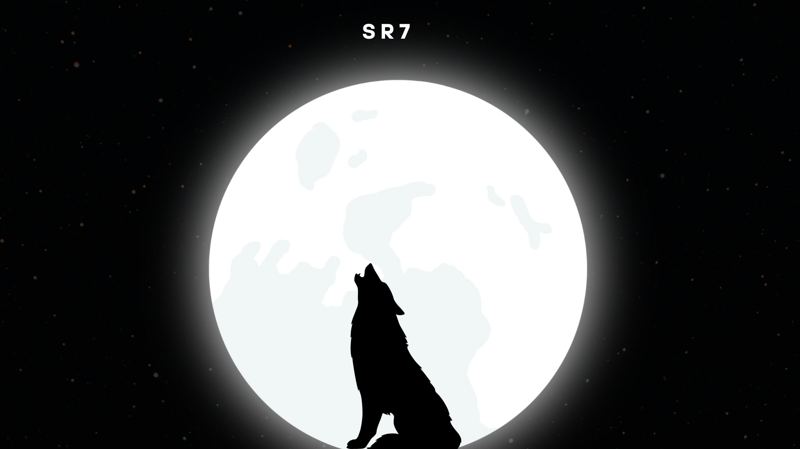

<h1 align="center">
    
</h1>

<h3 align="center">A passionate software developer from Kashmir.</h3>

 

 
 🔭 I’m currently working on **MERN STACK PROJECT ADN DSA**
 
 🌱 I’m currently learning **AWS**

💬 Ask me about **C++, Python, Data Structures, or anything [here](https://github.com/sahilrashid10/sahilrashid10/issues)**

⚡ Fun fact **Bananas are berries, but strawberries aren't! 🍌🍓**

 

 

 
  
  
  

 

 
<h2 align="center">⚒️ Languages-Frameworks-Tools ⚒️</h2>
 

    
     

 

  <h2>🐍 My Contributions 🐍</h2>
   
  
  
     

<h2 align="center">⚡ Stats ⚡</h2>
 

  
  
   
  

  
